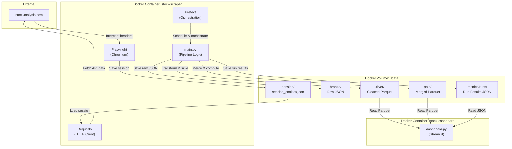
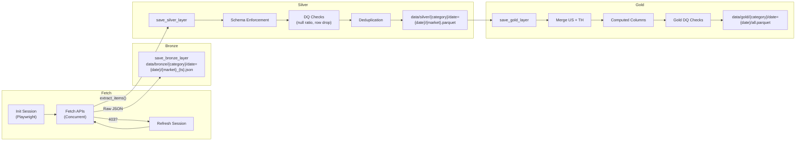
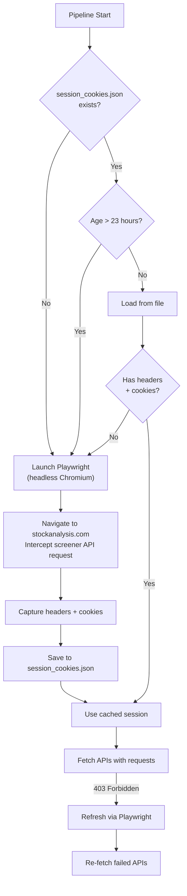
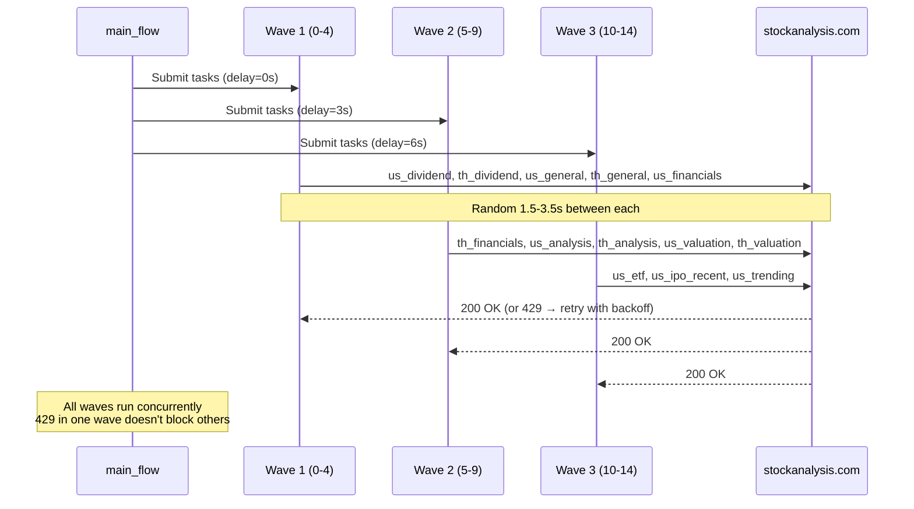
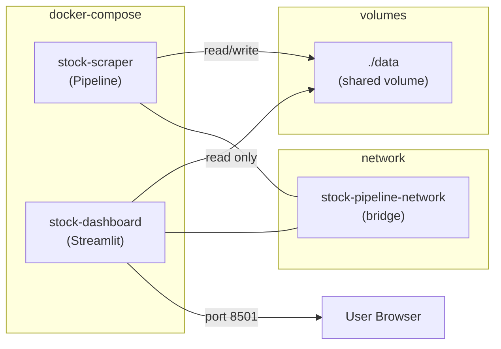

# Architecture

Detailed architecture documentation for the Stock Screener Data Pipeline.

---

## System Overview



---

## Data Flow



---

## Session Management Flow



---

## Concurrent Fetch Strategy



---

## Docker Architecture



| Container | Purpose | Resources | Port |
|---|---|---|---|
| `stock-scraper` | Pipeline + Prefect scheduler | 2GB RAM, 1.5 CPU | — |
| `stock-dashboard` | Streamlit monitoring UI | 512MB RAM, 0.5 CPU | 8501 |

---

## Module Structure

```
main.py (1,200 lines)
├── Configuration           (L1-57)      Constants, env vars, timeouts
├── API Definitions         (L59-110)    DAILY_APIS + INTRADAY_APIS
├── DQ Configuration        (L112-132)   Thresholds, key columns
├── Gold Computed Columns   (L135-161)   Lambda formulas for Gold layer
├── Schema Enforcement      (L163-218)   Expected columns per category
├── Data Quality Checks     (L220-278)   Null ratio + row count drop
├── Session Management      (L280-404)   Playwright + requests session
├── Data Extraction         (L406-444)   extract_items, _dict_to_records
├── Prefect Tasks           (L446-678)   init_session, fetch_url, save_bronze/silver, cleanup
├── Gold Layer              (L680-819)   save_gold_layer + gold DQ checks
├── Alerting                (L821-893)   Webhook notifications
├── Trading Day Check       (L895-913)   Weekend detection
├── Run Metrics             (L916-957)   Persist run results for dashboard
├── Main Flow               (L960-1081)  Pipeline orchestration
└── Scheduler               (L1083-end)  Prefect serve() with cron schedules

dashboard.py (575 lines)
├── Config + Styling        (L1-167)     Data paths, CSS, theme
├── Data Loading            (L170-289)   Scan partitions, load metrics, compute DQ
├── UI Sections             (L294-540)   Header, KPIs, charts, tables
└── Main                    (L546-575)   Tab layout + assembly
```

---

## Error Handling Strategy

| Error | Behavior | Retry? |
|---|---|---|
| **403 Forbidden** | Signal flow to refresh session → re-fetch | Yes (1x with new session) |
| **429 Too Many Requests** | Exponential backoff (5s, 10s, 20s) | Yes (3x) |
| **Timeout / ConnectionError** | Exponential backoff | Yes (3x) |
| **500+ Server Error** | Log and skip | No |
| **Invalid JSON** | Log and skip | No |
| **Playwright timeout** | Fall back to default headers | No |
| **Session file corrupted** | Refresh via Playwright | Automatic |
